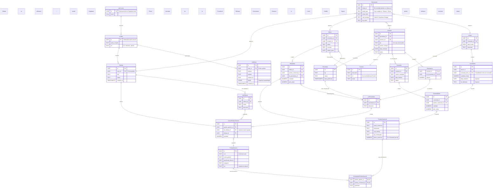

# Diagrama ERD

```mermaid
erDiagram

  Relația cu utilizatorii - model Supabase
  "auth.users" ||--o{ profiles : "are profil"
  profiles ||--o{ Referat : "creează"
  profiles ||--o{ AuditLog : "generează"

  Fluxul principal de la Referat la Procedură
  Referat ||--o{ CerereProdusGeneric : "conține"
  LotReferat ||--o{ CerereProdusGeneric : "grupează"
  Referat ||--o{ LotReferat : "este detaliat în"
  CerereProdusGeneric }|--|| ProdusGeneric : "specifică"
  Procedura ||--o{ LotProcedura : "este compusă din"
  LotProcedura ||--o{ CerereProdusGeneric : "include"

  Fluxul de Ofertare
  Oferta ||--o{ OfertaItem : "conține"
  Oferta }|--|| Furnizor : "transmisă de"
  Oferta }o--|| Procedura : "răspunde la"
  OfertaItem }|--|| ProdusComercial : "propune"
  OfertaItem }o--|| LotProcedura : "ofertează pentru"

  Fluxul de Contractare
  Contract }|--|| Procedura : "rezultă din"
  Contract }|--|| Furnizor : "semnat cu"
  Contract ||--o{ Comanda : "se execută prin"
  Contract ||--o{ ContractLot : "acoperă"
  ContractLot }|--|| LotProcedura : "se referă la"

  Fluxul de Comenzi și Livrări
  Comanda ||--o{ ComandaItem : "conține"
  ComandaItem }|--|| ProdusComercial : "comandă"
  Livrare }|--|| Comanda : "onorează"
  Livrare ||--o{ LivrareItem : "conține"
  LivrareItem }|--|| ComandaItem : "livrează"

  Entități Suport
  ProdusComercial ||--o{ EchivalentaProdusGeneric : "este echivalat prin"
  ProdusGeneric ||--o{ EchivalentaProdusGeneric : "este echivalat cu"
  Documente }o--|| Referat : "atașat la"
  Documente }o--|| Oferta : "atașat la"
  Documente }o--|| Contract : "atașat la"
  Documente }o--|| Livrare : "atașat la"

  Entități pentru utilizatori - model Supabase
  "auth.users" {
      UUID id PK "Cheie primară din Supabase Auth"
      string email
  }

  profiles {
      UUID id PK "Referință la auth.users.id"
      TEXT nume_complet
      TEXT rol "Ex: 'achizitor', 'admin'"
  }

  Entități de business
  Referat {
      UUID id PK
      UUID user_id FK "ID din profiles"
      TEXT titlu
      TEXT status
      TIMESTAMPTZ created_at
  }

  LotReferat {
      UUID id PK
      UUID referat_id FK
      TEXT nume
      TEXT descriere
  }

  CerereProdusGeneric {
      UUID id PK
      UUID produs_generic_id FK
      UUID lot_referat_id FK "Opțional, dacă e grupat"
      UUID referat_id FK
      NUMERIC cantitate
  }

  ProdusGeneric {
      UUID id PK
      TEXT cod "Cod intern unic"
      TEXT nume_generic
      TEXT specificatii_tehnice
      TEXT categorie
      TEXT um "Unitate de măsură"
  }

  ProdusComercial {
      UUID id PK
      TEXT nume_comercial
      TEXT producator
      TEXT cod_catalog
      TEXT um_comerciala
      NUMERIC factor_conversie "Ex: 48 (reacții per kit)"
  }

  EchivalentaProdusGeneric {
      UUID produs_generic_id PK,FK
      UUID produs_comercial_id PK,FK
      TEXT justificare
  }

  Procedura {
      UUID id PK
      TEXT tip
      TEXT status
      TIMESTAMPTZ data_publicare
  }

  LotProcedura {
      UUID id PK
      UUID procedura_id FK
      TEXT denumire
  }

  Furnizor {
      UUID id PK
      TEXT denumire
      TEXT cif "Cod de Identificare Fiscală"
      TEXT email
  }

  Oferta {
      UUID id PK
      UUID procedura_id FK
      UUID furnizor_id FK
      TEXT status
      TEXT moneda
      DATE valabil_pana
  }

  OfertaItem {
      UUID id PK
      UUID oferta_id FK
      UUID produs_comercial_id FK
      UUID lot_procedura_id FK
      NUMERIC cantitate
      NUMERIC pret_unitar
  }

  Contract {
      UUID id PK
      UUID procedura_id FK
      UUID furnizor_id FK
      TEXT tip "ferm sau acord-cadru"
      TEXT numar_contract
      DATE data_semnare
      TEXT status
  }

  ContractLot {
      UUID contract_id PK,FK
      UUID lot_procedura_id PK,FK
      NUMERIC valoare
  }

  Comanda {
      UUID id PK
      UUID contract_id FK
      TEXT numar_comanda
      DATE data_emitere
      TEXT status
  }

  ComandaItem {
      UUID id PK
      UUID comanda_id FK
      UUID produs_comercial_id FK
      NUMERIC cantitate
      NUMERIC pret_unitar
  }

  Livrare {
      UUID id PK
      UUID comanda_id FK
      DATE data_livrare
      TEXT observatii
  }

  LivrareItem {
      UUID id PK
      UUID livrare_id FK
      UUID comanda_item_id FK "Trasabilitate la linia de comandă"
      NUMERIC cantitate_livrata
      DATE data_expirare "Opțional"
      TEXT lot_fabricatie "Opțional"
  }

  Entități de sistem
  Documente {
      UUID id PK
      UUID entity_id "ID-ul entității părinte ex: referat_id"
      TEXT entity_type "Tipul entității ex: 'Referat', 'Oferta'"
      TEXT nume_fisier
      TEXT cale_storage "Calea în Supabase Storage"
      TEXT tip_mime
  }

  AuditLog {
      UUID id PK
      UUID user_id FK "ID din profiles"
      TEXT actiune
      TEXT entitate
      UUID entitate_id
      JSONB detalii "Snapshot înainte/după"
      TIMESTAMPTZ created_at
  }
```
